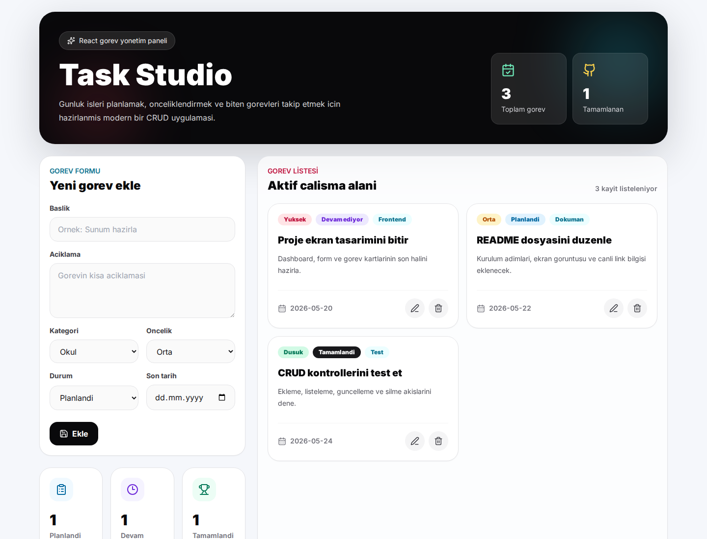

# Task Studio

Task Studio, React ile hazirlanmis modern bir gorev yonetim uygulamasidir. Uygulamada gorev ekleme, listeleme, guncelleme ve silme islemleri yapilabilir.

## Ozellikler

- Gorev ekleme
- Gorevleri listeleme
- Gorev guncelleme
- Gorev silme
- Oncelik, kategori ve durum takibi
- Verileri tarayicida saklama
- Responsive dashboard tasarimi

## Kullanilan Teknolojiler

- React
- Vite
- Tailwind CSS
- JavaScript
- LocalStorage

## Kurulum

```bash
npm install
npm run dev
```

## Build

```bash
npm run build
```

## Canli Demo

https://task-studio-dogukan.netlify.app

## GitHub

https://github.com/dogukanonderr/task-studio-js

## Ekran Goruntusu


